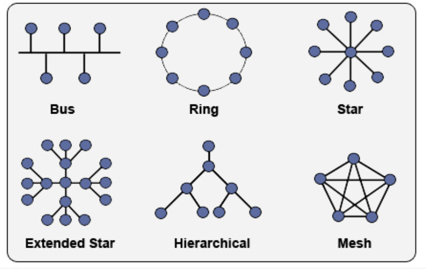
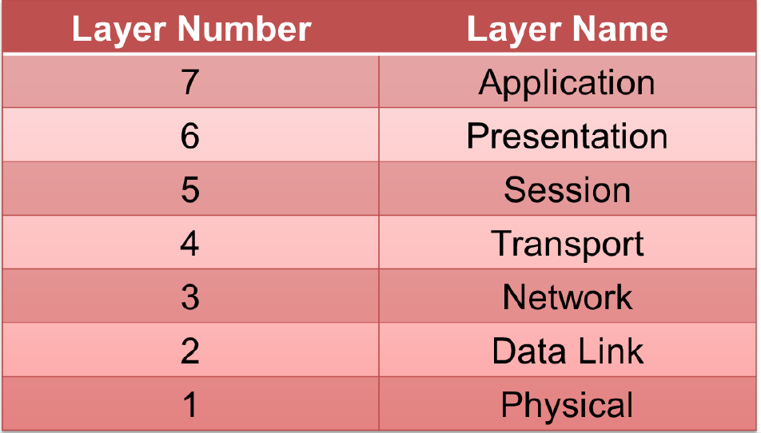

# Lecture 4: Networking Basics 

## Topologies 
* **Physical topology** - way physical components of the network are arranged (how we humans see the network) 
* **Logical topology** - how hosts on the network interact with each other 

**Bus Topology**

- Every component is connected to a single line with "taps" for each component 
- Advantages: quick to deploy & cheap 
- Disadvantage: lots of collisions, unreliable, a break causes the rest of the network to fail

**Ring Topology**

- Every component has 2 connections (a left and a right) 
- Like the bus topology, but there is a connection going back to the front 
- Disadvantage: performance is poor, it's not easy to scale, and a break in one connection causes the network to fail 

**Star Topology**

- Each node is connected to a central point 
- Most common physical topology 
- Adv: fast, non-central failure , scalable 
- Dis: used to be very expensive, there's a lot of cabling. 

**Mesh Topology**

- Adv: self healing, failure tolerant, potentially fast 
- Dis: no known route traversal, difficult to control and filter traffic 

## Ethernet Collisions 
* Ethernet cables = full duplex 
	* they send and receive data simultaneously 
* Half duplex - only send OR receive 
* Collisions occur when there are two hosts that try to use the connection at the same time 
* CSMA/CD - method for detecting collisions before they occur 

# OSI Model 
* Wanted to create a universal standard for networking 
* Layers 

Layer 7 - application/utility that stores, sends, or retrieves data across a network (UI layer) 

Layer 6 - responsible for formatting the data so that the application layer can recognize and work with it 

Layer 5 - deals with initiating and terminating network connections | Opens, uses, and closes a communication link 

Layer 4 - establishes 2 hosts are going to send data 

* There are 2 types of protocols
	* Connection-oriented (TCP) - reliable 
	* Connectionless (UDP) - unreliable 
* Breaks apart large data to send them 

Layer 3 - deals with the logical addressing  (IP addresses) 
 	
Layer 2 - MAC addressing 

Layer 1 - how data gets transmitted onto the wire, binary 

## Addressing 
* MAC - Unique hardware address for a network interface & should never change 
* IP address - assigned address within a network 
	* Public IP address - purchased from the Internet Service Providers (ISPs) 
	* Private IP address - on the internal network 
* Static vs. Dynamic IP address 
	* Dynamic - assigned by DHCP, assigned by the server or router, address will change based off of the length of the lease 
	* Static - manually entered into the system 
		* Manually assigned by the user or system administrator  
* **Gateway** - single point in a network that connects to the public internet 
	* This is the router in most home networks 