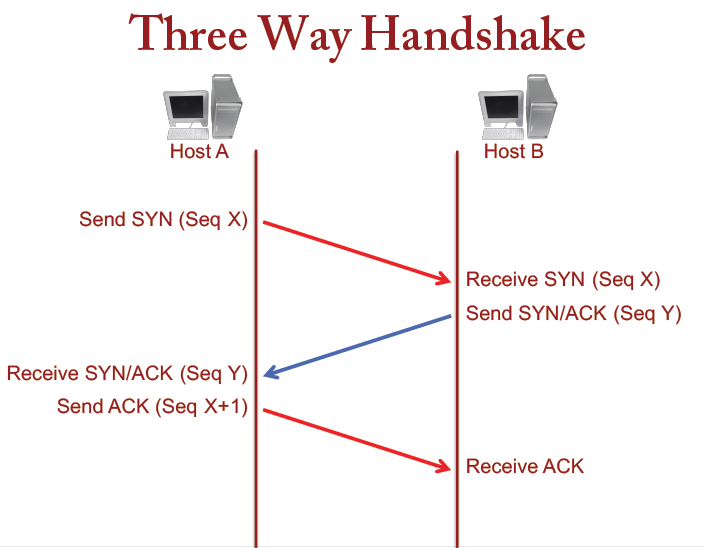
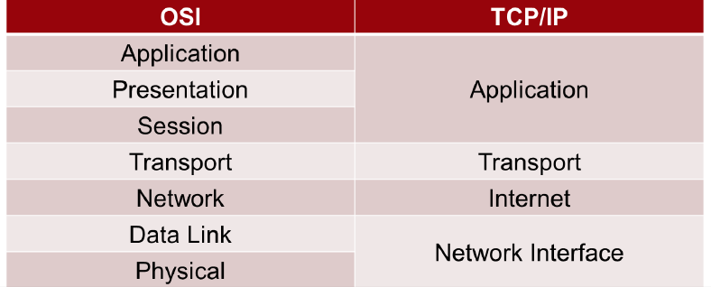

#Lecture 5: Networking II 

##3 way handshake 
* Establish a reliable connection 
* Sender sends SYN (synchronize) to the receiver saying what port it wants to connect to and the sequence number of the sender's first packet 
* Receiver sends back an acknowledgement saying that it is ready for the sender to send the packet
* Sender responds with the acknowledge that it received the receiver's packet and the connection has been established
* The data exchange begins 

They control how much information gets sent based off of how busy the receiving host is (sliding window) 

* if the receiver is busy, then the window will be smaller 
* If they are idle, then the window will be bigger 
* The window size is included in the header information for the packet 

##TCP/IP Model 
* This model is not OSI compliant 
* 4 Layers 
	* Application 
	* Transport 
	* Internet 
	* Network Interface 

#UDP 
* Focuses on speed 
* Used for time synchronization, gaming, streaming, VoIP   

##ICMP 
* Internet Control Message Protocol - used by network devices to send error messages
* Less commonly used than TCP & UDP 
* Designed to send small packages over a small bandwidth 
* Method is frequently used by hackers